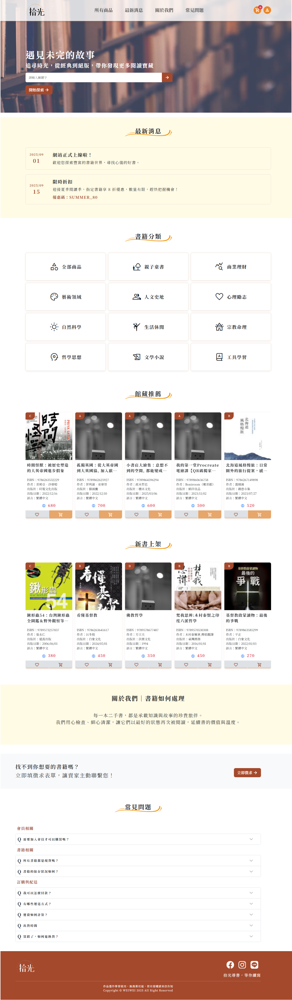
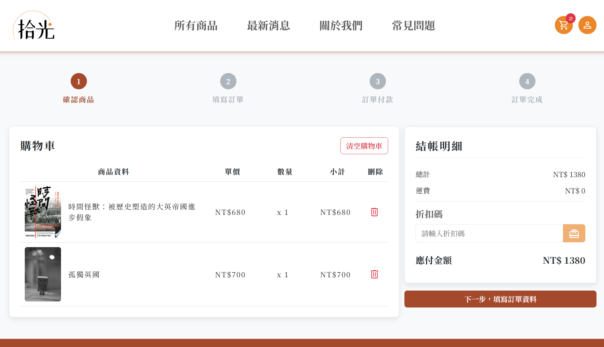
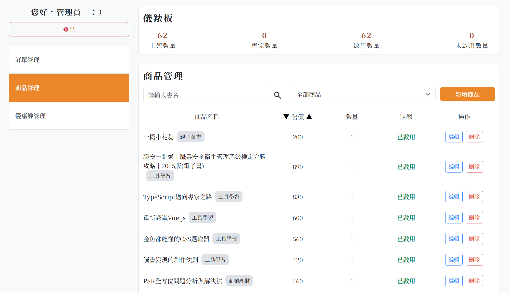

# Storylight 拾光

是一個獨立的二手書線上平台，整合了 **書籍瀏覽、購物車、會員中心與後台管理** 功能，提供完整的線上購物流程體驗。

在這裡，每本書都附有清楚的書況標示與完整說明，經過檢查與清潔後再度上架，讓讀者能放心挑選。

我們相信書籍不只是物品，更承載著知識、故事與記憶，等待下一位讀者繼續珍惜，陪伴你度過美好的閱讀時光。

---

## 畫面示意圖

### 首頁



### 購物車



### 會員中心


### 後台管理



---

## 專案功能

### 前台功能

- **首頁**
  - 導覽列：提供全站導航（首頁錨點 / 購物車 / 會員中心）。
  - 橫幅 Banner：呈現平台理念，附有全站書籍搜尋功能。
  - 最新消息：公告活動、促銷或書展資訊。
  - 書籍分類：依分類展示館藏，協助快速找到目標書籍。
  - 館藏推薦 / 最新上架，曝光熱門館藏與新進書籍。
  - 關於我們：介紹書籍檢查與清潔流程。
  - 徵求表單入口：「找不到想要的書？」。
  - 常見問題（Q&A），快速解答會員、書籍、訂購與配送相關疑問。

- **書籍分類頁、列表頁**
  - 提供分類篩選。
  - 書況標籤（A/B/C/D 分級）、圖片、書籍詳情描述。
  - 支援收藏（使用 LocalStorage）與加入購物車。

- **購物車**
  - 瀏覽已加入的書籍。
  - 移除商品。
  - 套用優惠券。
  - 進入結帳流程 → 模擬付款 → 完成訂單。

- **會員中心**
  - 註冊 / 登入帳號（模擬）。
  - 我的收藏（收藏清單）。
  - 許願徵求（模擬徵求列表）。
  - 訂單紀錄（查詢歷史訂單）。

### 後台功能 (Admin)

- 登入 / 登出
- 訂單管理
- 書籍管理
- 優惠券管理

---

## 技術棧

- **前端框架**: React 18 + Vite
- **路由**: React Router v7（使用 Hash Router 以支援 GitHub Pages）
- **狀態管理**: Redux Toolkit（Toast 狀態管理）+ React Context（模擬登入狀態）
- **表單驗證**: react-hook-form
- **UI 框架**: Bootstrap 5
- **樣式處理**: SCSS + Material Symbols / Icons
- **UI 元件**: SweetAlert2（對話框）、Swiper（輪播）
- **HTTP 請求**: Axios
- **其他**: Google Books API（書籍相關資訊）

---

## 共用組件

- **ToastComponent**：全站提示訊息（Redux slice 控制）
- **ScreenLoading**：畫面切換時的載入動畫
- **SkeletonLoading**：商品卡片等資料讀取前的骨架畫面
- **ReactLoading**：按鈕或局部元件的 loading spinner
- **SweetAlert2**：確認對話框、操作提示（刪除確認等）
- **Swiper**：書籍輪播元件（首頁推薦書籍展示）

---

## 專案結構

```plaintext
storylight/
│
├─ src/
│   ├─ assets/                     # 靜態資源統一管理
│   │   ├─ images/                 # 圖片，例如 logo、icon、banner
│   │   └─ stylesheets/            # SCSS 樣式
│   │       ├─ base/               # 基礎樣式
│   │       ├─ helpers/            # 工具變數、mixin、functions (colors, spacing)
│   │       ├─ pages/              # 頁面專屬樣式
│   │       ├─ skeleton/           # skeleton loading 樣式
│   │       └─ all.scss            # 全域樣式入口
│   │
│   ├─ components/                 # 可重複使用的 UI 元件
│   │   ├─ common/                 # 全站共用元件
│   │   └─ skeleton/               # Skeleton loading 元件
│   │
│   ├─ context/                    # React Context（狀態管理）
│   │   ├─ AppContext.jsx          # 應用程式全域狀態
│   │   ├─ CartContext.jsx         # 購物車狀態
│   │   ├─ FavoritesContext.jsx    # 收藏功能狀態
│   │   ├─ UserContext.jsx         # 用戶資訊狀態
│   │   ├─ ProductContext.jsx      # 產品資料狀態
│   │   ├─ OrderContext.jsx        # 訂單資料狀態
│   │   └─ AdminContext.jsx        # 後台專用狀態
│   │
│   ├─ providers/                  # Context Providers 包裝層
│   │   ├─ FrontProviders.jsx      # 前台 Providers 組合
│   │   └─ AdminProviders.jsx      # 後台 Providers 組合
│   │
│   ├─ data/                       # 資料檔案與工具
│   │   ├─ categories.js           # 書籍分類資料
│   │   ├─ config.js               # API 路徑 / BASE_URL, API_PATH
│   │   ├─ images.js               # 圖片路徑常數
│   │   ├─ adminAxios.js           # Admin 專用 Axios 實例
│   │   └─ swalConfirm.js          # SweetAlert2 確認對話框工具
│   │
│   ├─ features/                   # 功能頁面（Feature-based）
│   │   ├─ admin/                  # 後台管理頁面
│   │   ├─ front/                  # 前台頁面
│   │   ├─ front_cart/             # 前台購物車流程頁面
│   │   └─ member/                 # 會員中心頁面
│   │
│   ├─ redux/                      # Redux slice（UI 狀態管理）
│   │   └─ toastSlice.js           # Toast 通知狀態
│   │
│   ├─ routes/                     # 路由配置
│   │   └─ index.jsx               # 路由表定義
│   │
│   ├─ store/                      # Redux store 設定
│   │   └─ store.js                # Store 入口（整合所有 slice）
│   │
│   └─ main.jsx                    # React 應用程式入口
│
├─ public/                         # 靜態資源（部署用）
├─ .env                            # 環境變數（不納入版控）
├─ vite.config.js                  # Vite 配置
├─ package.json                    # 依賴套件與腳本
└─ README.md                       # 專案說明文件
```

---

## 架構設計

### 狀態管理策略

專案採用 **Redux Toolkit** + **React Context** 混合架構：

- **Redux Store**：集中管理 UI 狀態（Toast 通知）
- **React Context**：分層管理應用程式狀態，依功能領域拆分為 7 個 Context

### Context 分層說明

#### 前台 Context

- **AppContext**：應用程式全域狀態（載入狀態、錯誤處理）
- **UserContext**：用戶認證與個人資訊
- **CartContext**：購物車資料與操作
- **FavoritesContext**：收藏清單管理（LocalStorage 持久化）
- **ProductContext**：商品資料與篩選
- **OrderContext**：訂單資料與歷史紀錄

#### 後台 Context

- **AdminContext**：後台管理專用狀態（商品/訂單/優惠券管理）

### Provider 包裝模式

使用 **Provider Composition Pattern** 統一管理 Context 注入：

- **FrontProviders**：包裝所有前台 Context，提供給前台路由使用
- **AdminProviders**：包裝後台 Context，提供給後台路由使用

### 路由架構

採用 **Hash Router** 支援 GitHub Pages 部署：

```
/ (FrontProviders)          # 前台路由群組
├─ 首頁、分類、商品詳情
├─ 購物車流程
└─ 會員中心

/admin (AdminProviders)     # 後台路由群組
├─ 商品管理
├─ 訂單管理
└─ 優惠券管理
```

---

## 路由 (Routes)

### 前台

- `/` → 首頁
- `/:categoryName` → 書籍分類頁
- `/:categoryName/:productId` → 書籍詳情頁
- `/signin` → 註冊
- `/login` → 登入
- `/member` → 會員中心
  - `/member/favorites` → 我的收藏
  - `/member/wish` → 許願徵求
  - `/member/order` → 訂單紀錄
- `/cart` → 購物車
  - `/cart/order` → 訂單資訊
  - `/cart/payment` → 付款頁
  - `/cart/complete` → 完成訂單

### 後台 (Admin)

- `/admin/login` → 後台登入
- `/admin/product` → 商品管理
- `/admin/order` → 訂單管理
- `/admin/coupon` → 優惠券管理

### 其他

- → 404 Not Found

---

## 安裝與執行

### 1. 取得專案

```bash
git clone https://github.com/weiweihuang93/react-storylight.git
cd react-storylight
```

### 2. 安裝依賴

```bash
npm install
```

### 3. 環境變數設定

在專案根目錄建立 `.env` 檔案（請參考下方「環境變數設定」章節）

### 4. 開發指令

```bash
# 啟動開發伺服器（預設 http://localhost:5173）
npm run dev

# 執行 ESLint 檢查
npm run lint

# 建置生產版本
npm run build

# 預覽生產版本
npm run preview

# 部署到 GitHub Pages
npm run deploy
```

---

## 環境變數設定

請在專案根目錄建立 `.env` 檔案，並依需求填入以下參數：

```env
VITE_BASE_URL=''              # API 基礎網址
VITE_API_PATH=''              # API 路徑
VITE_GOOGLE_BOOKS_API_KEY=''  # Google Books API 金鑰
```

⚠️ **注意事項**：

- `.env` 檔案已加入 `.gitignore`，請勿上傳至 GitHub
- 環境變數必須以 `VITE_` 開頭才能在前端使用
- 修改環境變數後需重新啟動開發伺服器

---

## 部署說明

### GitHub Pages 部署

本專案已配置 GitHub Pages 自動部署：

#### 部署步驟

```bash
# 1. 建置生產版本
npm run build

# 2. 部署到 gh-pages 分支
npm run deploy
```

#### 部署配置

- **Base Path**: `/react-storylight/` (設定於 `vite.config.js`)
- **Router 模式**: Hash Router（相容 GitHub Pages）
- **部署分支**: `gh-pages`

#### 存取網址

部署成功後，可透過以下網址存取：

```
https://weiweihuang93.github.io/react-storylight/
```
